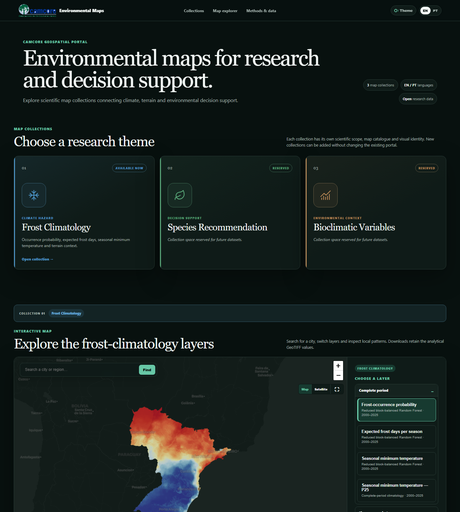
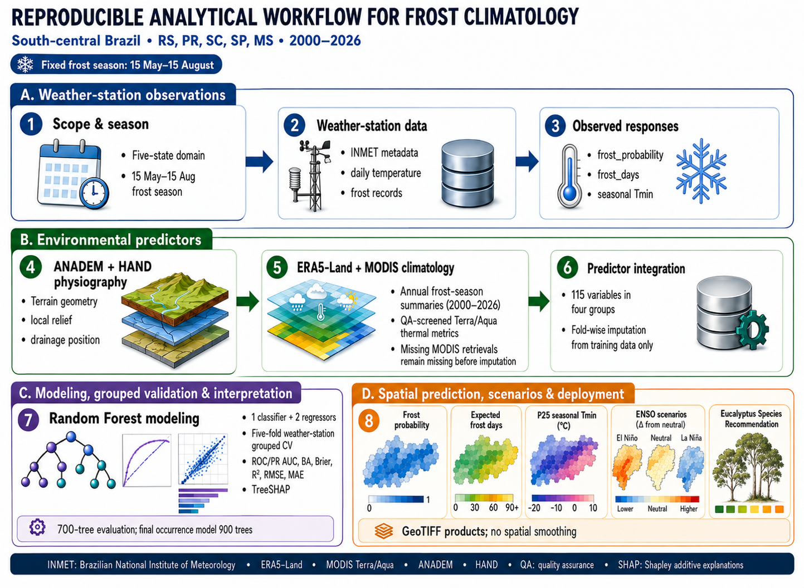

# Camcore Environmental Maps

[Português](#português) · [English](#english) · [Interactive portal](web/index.html)



## Analytical workflow / Fluxo analítico



This infographic summarizes the complete station-based workflow, from observed frost responses and environmental predictors through grouped spatial validation, interpretation and 30 m GeoTIFF products.

O infográfico resume o fluxo completo baseado em estações meteorológicas, desde as respostas observadas e os preditores ambientais até a validação espacial agrupada, a interpretação e os produtos GeoTIFF de 30 m.

## Citation and contributors / Citação e colaboradores

GitHub citation metadata are provided in [`CITATION.cff`](CITATION.cff), and the current manuscript author list is documented in [`CONTRIBUTORS.md`](CONTRIBUTORS.md). Individual CRediT roles will be added only after approval by all authors.

## English

This repository supports a bilingual portal for Camcore environmental map collections. **Frost Climatology** is the active collection. **Species Recommendation** and **Bioclimatic Variables** are reserved as independent, intentionally empty collections until their scientific datasets and documentation are ready.

### Portal collections

- **Frost Climatology — active:** occurrence probability, expected frost days, seasonal minimum temperature and terrain context.
- **Species Recommendation — reserved:** no layers or results published yet.
- **Bioclimatic Variables — reserved:** no layers or results published yet.

Future datasets should receive their own catalogue, methods and provenance rather than being mixed into the frost-climatology collection.

Reproducible code, metadata and a bilingual map portal for frost-risk products covering Rio Grande do Sul, Santa Catarina, Paraná, São Paulo and Mato Grosso do Sul, Brazil.

### Scientific outputs

The production workflow estimates three endpoints:

1. frost-occurrence probability;
2. expected frost days per eligible season;
3. seasonal minimum temperature, including P25 cold-tail summaries.

The model uses a versioned, reduced predictor contract organized into spatial, terrain/HAND, ERA5-Land and MODIS blocks. Complete-period products summarize 2000–2025; additional outputs represent five-year periods and ENSO classes.

### Run the analysis

- **Workstation — Python:** [`local/python`](local/python) contains portable scikit-learn training and tiled raster prediction.
- **Workstation — R:** [`local/R`](local/R) contains a pure-R `ranger` implementation and `terra` raster prediction.
- **HPC — LSF/Hazel:** [`hpc`](hpc) preserves the production array, checkpoint and merge workflow.
- **Exact production scripts:** [`src/pipeline`](src/pipeline) preserves the scripts used during analysis and their execution order.

Start with [`local/README.md`](local/README.md) and [`docs/REPRODUCIBILITY.md`](docs/REPRODUCIBILITY.md).

### Terminology

“Smoke test” is a legitimate software-engineering term for a small end-to-end test. To avoid confusing it with scientific model validation, public documentation uses:

- **preflight validation** for dependency and input checks;
- **reduced-scale integration check** for a small end-to-end run;
- **spatial cross-validation** for scientific performance assessment.

Historical filenames containing `smoke` are retained to preserve provenance and compatibility with completed HPC runs.

### Data availability

The GitHub repository contains code, metadata and lightweight map previews. Final full-resolution GeoTIFFs will be deposited in Dryad after merge and quality control. The current probability layer is explicitly an incomplete development preview.

ANADEM must be cited as Laipelt et al. (2024), DOI [10.3390/rs16132321](https://doi.org/10.3390/rs16132321). Third-party datasets retain their original terms and are not relicensed here.

## Português

Código reprodutível, metadados e portal bilíngue dos mapas de risco de geada para Rio Grande do Sul, Santa Catarina, Paraná, São Paulo e Mato Grosso do Sul.

### Produtos científicos

O fluxo de produção estima três respostas:

1. probabilidade de ocorrência de geada;
2. número esperado de dias de geada por estação elegível;
3. temperatura mínima sazonal, incluindo resumos P25 da cauda fria.

O modelo utiliza um contrato reduzido e versionado de preditores espaciais, terreno/HAND, ERA5-Land e MODIS. Os produtos do período completo resumem 2000–2025, com resultados adicionais para períodos de cinco anos e classes ENSO.

### Como executar

- **Computador local — Python:** [`local/python`](local/python).
- **Computador local — R:** [`local/R`](local/R).
- **HPC — LSF/Hazel:** [`hpc`](hpc).
- **Scripts exatos de produção:** [`src/pipeline`](src/pipeline).

Comece por [`local/README.md`](local/README.md) e [`docs/REPRODUCIBILITY.md`](docs/REPRODUCIBILITY.md).

### Terminologia

“Smoke test” é tecnicamente correto na engenharia de software, mas não é uma estatística de validação. Nos textos públicos usamos **validação prévia**, **verificação de integração em escala reduzida** e **validação cruzada espacial**, conforme a finalidade.

## Repository structure / Estrutura

```text
config/         portable path templates
docs/           methods, provenance and reproducibility
hpc/            LSF production workflow
local/python/   portable Python implementation
local/R/        portable R implementation
metadata/       feature manifests and scenario definitions
src/pipeline/   frozen production scripts
web/            bilingual GitHub Pages portal
```

Code licensing remains pending author approval. No credentials or machine-specific private paths belong in the public repository.
